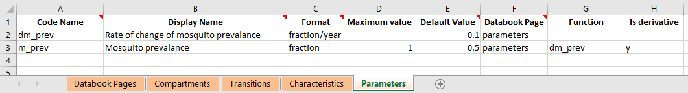

Parameters
##########

Types of parameter
******************

Parameters are all defined on the 'Parameters' sheet of the framework. Depending on the structure of the model defined in the framework, a parameter may have certain attributes or restrictions if used in a particular way. We therefore introduce three classifications to help refer to such parameters. These classifications are:

- **Transition parameter** - A parameter is referred to as a 'transition parameter' if it appears in the transition matrix and is thus *directly* associated with flow rates. 
- **Function parameter** - A parameter is referred to as a 'function parameter' if a function is provided in the Framework for the parameter
- **Output parameter** - A parameter is referred to as an 'output parameter' if it does not directly or indirectly contribute to transitions. A parameter contributes directly to transitions if it is an output parameter, but it can also contribute indirectly if it appears in a transition parameter's function (or even further back, if it appears in the function of any parameter that ends up affecting a transition parameter)

Functions
*********

In the framework, a parameter can have a function associated with it, which can compute the value of a parameter based on the values of other integration objects like compartments, characteristics, parameters, and links (flow rates). You can also refer to the simulation time as `t` and the time step as `dt`. Standard math operations can be performed, as well as common functions like ``max``, ``min``, ``exp`` etc. Valid functions can be found in ``function_parser.py``. 

Parameters are updated in the order in which they appear in the framework. This means that parameter functions can only refer to parameters that appear above them in the framework. Atomica will automatically validate this when the framework is loaded. This also means that any program overwrites that affect terms inside a parameter function will be performed prior to the function being evaluated. 

As mentioned above, it is possible to include actual flow rates in parameter functions. These can be specified in two ways

- You can append ``:flow`` to the name of any transition parameter which resolves to the sum of all transitions driven by that parameter. This means if a parameter drives multiple transitions (e.g. deaths from multiple compartments) they will also be included
- You can use the compartment syntax to specify flows between compartments e.g. ``sus:vac`` for flows between susceptible and vaccinated, ``sus:`` for all flows out of susceptible, and ``:vac`` for all flows into vaccinated. You can also use ``sus:vac:par_name`` to select only flows between compartments driven by a particular parameter, in the case where multiple parameters contribute independently to the same transition.

.. caution::

    All link values are automatically annualized inside the parameter function and are in units of 'people/year' - this prevents the values from changing relative to other parameters if the model step size is changed.

Finally, all parameters are updated prior to computing flow rates. This is because flow rates may need to be rescaled in order to prevent negative compartment sizes, and this rescaling can only take place after all parameters have been computed. Thus, flow rates cannot appear in any parameter that contributes directly or indirectly to transitions, as there would otherwise be a circular dependency.

.. caution::

    Links can only be used inside parameter functions for output parameters

Performance considerations
**************************

The structure of the parameters in the model can have a significant effect on performance. The root causes is that in Python, it is much faster to perform calculations with vectorized operations rather than repeated scalar operations. 

A vectorized operation is one that can be performed on all time points simultaneously, whereas a scalar operation operates on only one time point at a time. Operating one time point at a time is required if two conditions are met

- The parameter is required to directly or indirectly drive a transition, **and**
- The parameter depends on a compartment or characteristic

If a parameter depends on a compartment or characteristic, then it can only be evaluated after the compartment sizes have been computed. In the case of output parameters, this can be performed as a fast vector operation after integration is complete. If that same parameter drives transitions however, then it must be evaluated during integration using slower scalar operations. Similarly, if a parameter only depends on quantities in the databook (even if it depends on other parameters, as long as those parameters only depend on the databook) then the parameter can be evaluated in a fast vector operation either before or after integration, depending on whether it is needed for transitions.

Atomica will automatically select the fastest possible computation, but be aware that the inclusion of compartments and characteristics in parameter functions can have a significant effect on performance. 

Timescales
***********

Transitions in the model are driven by parameters. If the parameter is specified as a probability or a number of people, then there is an implicit time period associated with the flow. This is 1 year by default. So for example,

- A transition parameter in probability units is interpreted as 'probability (per year)'
- A transition parameter in number units is interpreted as 'number of people (per year)'
- A transition parameter in duration units is interpreted in years

However, working exclusively with years can be problematic for two reasons

1. The values entered in the databook are entered in the same units as the parameter. In some cases, it may be preferable for end users to enter values in different units. For example, for fast processes it may be clearer to enter values in days rather than years. Similarly, in some cases available data may list outcomes over different timescales e.g. probability of treatment success over a 1 month period. Although this can be inconvenient, it is possible to use formulas in the databook to work around this, or conversions in the framework. However, either option adds considerable complexity.
2. If models are run with very small timesteps, such as daily time steps (required for frameworks where the fastest processes are on this timescale - for example, the mosquito lifespan for malaria is on this scale) - then the rescaling of probabilities by repeated sampling can suffer from loss of numerical precision. This is particularly problematic when moving between daily and annual probabilities. This is a critical issue that can prevent implementation of a model.

To address this, it is possible to optionally specify a *timescale* associated with a parameter. The timescale specifies the period in years associated with a parameter. If not specified, parameters are treated as having a timescale of 1, which corresponds to annual units. If a different value is entered, the effect is to change the units of the parameter. For example, if the timescale was entered as :math:`1/365 = 0.00274`, then the parameter would be treated as a daily quantity. The exact units depend on the format of the quantity:

- If the transition parameter has timescale :math:`1/365` and format 'duration' then the units are 'days'
- If the transition parameter has timescale :math:`1/365` and format 'probability' then the units are 'probability per day'
- If the transition parameter has timescale :math:`1/365` and format 'number' then the units are 'number per day'

If a parameter has a timescale, then the units in the databook will automatically reflect the timescale. If a timescale is present in the databook, then the framework must have a matching timescale. So for example, if the framework declares that a parameter has timescale :math:`1/365` (days) then the databook *must* provide the value in days (i.e. users cannot change this in the databook by changing it to read 'weeks' without making a corresponding change to the framework).

The timescales affect simulations and plotting in two ways

1. During model integration, the parameter is in the units specified in the framework, but flows in the model (the values stored in ``Link`` objects) are *always* in 'number per timestep' units. If a parameter has a timescale, that timescale will affect the conversion
2. When constructing a ``PlotData`` object with time aggregation or accumulation, the timescale will be taken in to account. Where applicable, plots will be labelled including the timescale (e.g. a probability parameter with a timescale of :math:`1/52` would have an axis label of 'Probability (per week)' on plots). 

Thus, Parameter objects themselves always store values in the units specified in the framework. Conversion only takes place during computation of flow rates or computation of ``PlotData`` aggregations. 

.. note::

    Because Parameter timescales are only converted when computing flow rates, user-defined parameter functions always operate on parameters in their native units. 

This means that it is up to the modeller to explicitly handle any unit conversions required - for example, if combining a 'Number per day' and a 'Number per week' in a function, it would likely be necessary to explicitly introduce a factor of ``7``. This would be done in the Framework in conjunction with specification of the timescales for the relevant parameters. Users are unable to change the timescale in the databook by design because the conversion is an arbitrary operation and depends on the parameter timescale - the modeller has complete control in the Framework to define the format and units and construct the model accordingly, without having to deal with the possibility of the user entering different formats or units. 

Derivatives
***********

Sometimes, it is important to track quantities dynamically. For example, you may want to model a change in pollution level depending on the number of people in the model, where the *derivative* of pollution depends on the number of people. This cannot be achieved with normal parameters, because parameter functions explicitly supply the value for the parameter at each timestep. Compartment values are effectively governed by derivatives, but setting the values is nontrivial because of the need to have source and sink compartments. 

Instead, it is possible to mark a parameter function as supplying a derivative rather than the value itself. Suppose we have a parameter function :math:`f(\theta,t)` where :math:`\theta` represents the state of the model (so it encompasses any quantities that could appear in the parameter function), and :math:`t` is the current simulation time. If we want the parameter function to act as a derivative, enter 'Y' in the 'Is derivative' column of the databook, as shown below. This column can be added in if it is not already present.

When marking the parameter as a derivative:

1. The parameter value is initialized as normal from values entered in the databook
2. The parameter function :math:`f(\theta,t)` is evaluated like normal. The parameter function can refer to any other parameters previously defined in the framework. However, unlike normal parameters, a derivative parameter can also refer to its own value. Derivative parameters are updated out of sync with the rest of the model - after the value of the derivative is computed at time `ti`, we can immediately assign the value of time ``ti+1``, whereas with normal parameter, the parameter function needs to be executed at time ``ti+1`` in order to determine the value. For derivative parameters, the parameter function being evaluated at time ``ti+1`` yields the value of the *derivative* at time ``ti+1``, rather than the actual value. Therefore, it is possible to refer to the parameter's current value inside the function, because the function is not being used to compute that value. In effect, you can simply refer to the parameter by name inside a derivative function, as illustrated in the ``framework_derivative_test.xlsx`` example in the ``tests`` folder.
3. Normally, the parameter value is updated as  :math:`P(t) = f(\theta,t)` - that is, the function is evaluated and directly overwrites the parameter value. However, if the parameter is marked as a derivative, then the update is  :math:`P(t+1) = P(t) + \Delta t f(\theta,t)`. That is, a single step of an Euler integration is performed.

.. note::

	Don't forget that the databook contains the initialization values for the parameter, and thus needs to be entered in the same units as the parameter itself.

Derivative parameters must have both a databook page (for the initialization value) and a function (for the derivative value) and an error will be raised if either is missing.

Program overwrites are applied to the derivative. So if you define a derivative parameter, don't forget that programs do not overwrite the actual value, but they overwrite the derivative. You could set another parameter equal to the derivative parameter and target that instead, if you wish to explicitly overwrite the value of a derivative parameter - however, be cautious and inspect results carefully if you then later switch programs off.

After integration, the parameter value can be inspected and analyzed as normal. Note that this means you cannot directly read out :math:`f(\theta,t)` because the parameter has integrated :math:`f(\theta,t)` over time. Note also that the update step multiplies :math:`f(\theta,t)`  by :math:`\Delta t`. This means that the units of the value returned by the parameter function should be the same as the units of the Parameter, but on a 'per year' basis. This is because :math:`\Delta t` is in units of years. So in the example above, ``m_prev`` is a dimensionless fraction, and the parameter function has the same units as ``dm_prev``, which is in units of ``1/years``, thus when integrated, ``m_prev`` will be dimensionless. It is important that this multiplication by :math:`\Delta t` is taken into account, because this formulation allows consistent results to be obtained even when the step size is changed.

.. warning::

	Notice that the parameter timescale does not enter here. The parameter timescale affects the conversion from the parameter value into flow rates. The derivative is always with respect to time, in the *simulation* units, which are always years. Thus the function value's units should differ from the parameter's units by a factor of ``1/years`` regardless of the timescale of the parameter. If you have set different timescales for quantities appearing in the derivative parameter's function, you may need to include conversion factors in the parameter function to ensure that the timescale of the derivative comes out correctly.

Interpolation and smoothing
***************************

Parameters generally contain sparse time-dependent values matching those entered in the databook. As part of running the model, these automatically get interpolated onto the simulation time points. This interpolation is linear by default (although legacy projects use spline interpolation). Generally, this means that you can look at the values in the databook and they will be linearly interpolated when running the simulation.

However, in some cases, it is desirable to incorporate additional assumptions into the input parameters - for example, that they are smoothly changing. To support this, ``Parameter`` objects contain a smoothing method, ``Parameter.smooth``. This applies smoothing in-place, onto a set of specified time points, replacing the parameter's value. The most common usage would be to simply use ``Parameter.smooth(proj.settings.tvec)`` which will smooth the parameter onto the simulation times (assuming the step size is not subsequently modified).

By specifying a different set of times, you can apply different smoothing methods to different parts of the parameter. For example, you could smooth parameter scenario values differently to the databook values. Don't forget that you can always modify the ``TimeSeries`` object contained in the ``Parameter`` as well, to perform arbitrarily specific modifications.

Maximum compartment duration
****************************

Intended usage
- NOT used when there is a constant inflow/outflow or if inflows and outflows are slowly changing
- In a compartment model, the amount of time people spend in the compartment follows an exponential distribution. In the steady state, only the mean matters. When things change rapidly, then discrepencies can occur. These discrepencies are largest if the compartment has a long expected duration relative to the step size, and if the inflow changes dramatically.

Therefore, the maximum compartment duration is suitable under the following circumstances
- The expected time in the compartment is long relative to the step size (e.g. >4 timesteps), and
- At the end of the duration, all individuals transition to the same compartment (although this could be a junction), and
- There are sharp changes to inflow or outflow

Two examples of where this usage might be appropriate:

- A mass vaccination schedule where
    - A large proportion of the population is vaccinated at the same time
    - The duration of protection is several years
    - At the end, all uninfected individuals return to the susceptible compartment
- TB early to late latent states
    - The time spent in the early latent state is several years
    - At the end, all infected individuals progress to late latent
    - The inflow changes rapidly if the force of infection changes due to interventions e.g. treatment scale-up reducing the number of new infections

One example of where this usage would be inappropriate
- Treatment lasts 6 months
    - The expected time spent in the compartment is only 1-2 timesteps, so the approximation that the time spent in the compartment by individuals is uniformly distributed is sufficiently good even if the treatment initiation rate changes rapidly

Timed parameter restrictions

x - If entered in the databook, only a constant value can be provided
- If it has a function, then it must be precomputable and have the same value at all times
x - Cannot be marked as a derivative
x - Must be in 'duration' units
x - Cannot be marked as 'targetable' (i.e. cannot be changed by programs)
x - Any given compartment can have a maximum of one outgoing timed transition

