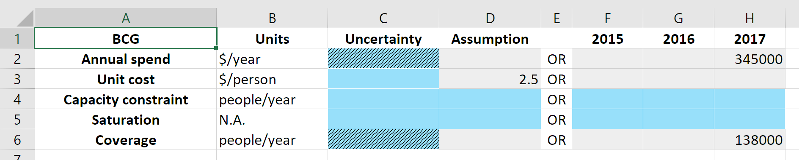
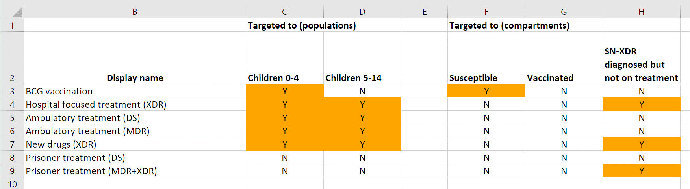
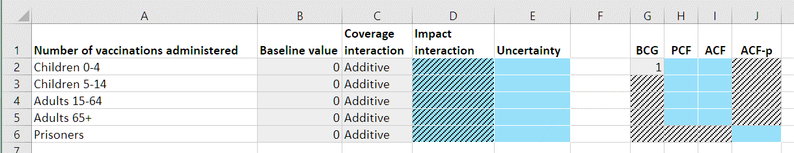

Program System
==============

The role of the programs module is to produce simulations in which spending on programs has been used to compute the parameter values driving transitions between compartments in the model. An overview is shown below:

.. image:: programs_schematics/slide5.png
	:width: 400px

The way this is achieved is by the ProgramSet overwriting the parameter values during integration. 

.. image:: programs_schematics/slide4.png
	:width: 400px

General workflow
----------------

The broad strategy for mapping spending to parameter values is

1. Use spending and unit cost to calculate the program's capacity
2. Use the program's capacity and the number of people eligible for the program to compute the fraction covered
3. Use the fraction covered to calculate the parameter value

Capacity
^^^^^^^^^

The capacity of a program (in some contexts, referred to as the 'coverage numerator') can be thought of as the maximum number of people that could be reached by an intervention for a given budget. For example, it might correspond to the number of doses of a treatment that can be purchased with the available funds. There are fundamentally two types of programs

- One-off programs, in which a cost is incurred every time a person is reached by a program (e.g. the cost per dose of a treatment)
- Continuous programs, in which a cost is incurred over a period of time for a person being reached by the program (e.g. the cost of providing ART to a person for a year)

The key difference between the two is that if a program reaches 100 people per year, and the simulation timestep is 0.25 years, then the 100 people reached by the one-off program are distributed throughout the year, and in the first quarter only 25 people can be reached by the program. In contrast, the continuous program would reach 100 people in every quarter.

In terms of differentiating the two types of programs, spending on programs is always provided as '$/year'. The capacity of the program is the total spend, divided by the unit cost. For one-off programs, the unit cost is provided as '$/person' and thus the capacity would be returned as 'people/year'. For continuous programs, the unit cost is provided as '$/person/year' and thus the capacity would be returned as 'people'.

Capacity comes from spending and unit cost, entered in the 'Spending data' sheet:

These are then combined into the capacity

.. image:: programs_schematics/slide1.png
	:width: 400px

The capacity constraint serves as hard upper limit on the capacity. 

Targeting
^^^^^^^^^

Programs are targeted at a subset of available compartments

.. image:: programs_schematics/slide3.png
	:width: 400px

This information is entered on the 'Program targeting' sheet in the progbook

Coverage
^^^^^^^^

The fraction covered is given by dividing the program's capacity by the number of people eligible for the program. For example, if a program is targeted at a set of compartments with 100 people in total, and the program's capacity is 25, then the fraction covered is 0.25. The fraction covered is capped at 1.0 (for example, if the program's capacity was greater than 100 people), and is non-dimensional.

The number of people eligible for the program is given by summing the targeted compartments at a particular instant in time. Thus, in this calculation, the capacity must be in units of 'people' rather than 'people/year'. For a one-off program, the fraction covered therefore needs to be multiplied by the simulation timestep prior to performing this calculation. So for example, with a total spend of 1000 ($/year) and a unit cost of 10 ($/person) the capacity would be 100 (people/year) and with a timestep of 0.25, in the first quarter, the capacity would be 100*0.25 (people), which is the required result for a one-off program.

The fractional coverage is obtained by dividing the capacity by the number of people eligible

.. image:: programs_schematics/slide2.png
	:width: 400px

Outcomes
^^^^^^^^

The final stage in the programs calculation is going from the program's fractional coverage to program outcomes. 

This is handled programatically by the ``Covout`` class. There are three types of coverage interaction

- Additive
- Random
- Nested

And in addition, it is possible to override the impact of multiple programs.  

