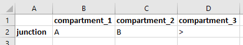

Junctions
#########

Junctions offer a way to re-parametrize transitions when the relative proportions of outflows are constrained. As discussed in other pages, they are special compartments that are emptied entirely at the end of each timestep. As a result, the total number of people leaving the compartment is not determined by any parameter values, because it directly corresponds to the number of people in the compartment. Instead, the parameter values are all proportions that govern the relative outflows. 

The general layout of a junction is shown below:

In this example, any parameters supplying values for transitions `A`, `B`, and `C` all need to be in 'proportion' units. During simulation, the sum of outflows A, B, and C would equal 100 people. Junctions come in two varieties

1. A junction where all of the outflows have been explicitly specified. In this case, outflows are proportionately rescaled across all transitions. This is implemented in the ``Junction`` class.
2. A junction where all outflows *except one* have been specified. In this case, any residual outflow is flushed to a single compartment. This is implemented in the ``ResidualJunction`` class.

The type of junction depends on the 'Transitions' sheet in the Framework file. For a regular junction, simply enter the transitions the same as for any compartment. The schematic above could be implemented as

The role of a residual junction is to make it easier to implement junctions where one of the outflows balances all of the others. For example, if the schematic at the top of the page satisfied :math:`C=1-A-B`. In that case, rather than defining a parameter for ``C``, the junction could instead be written as

This syntax means that the flow from the junction to ``compartment_3`` would equal ``max(0,1-A-B)``. That is, if :math:`A+B<1` then the residual will be assigned to :math:`C`. Consider the following examples for the compartments shown in the schematic above:

.. csv-table::
   :header: Transition,Parameter value,Outflow
   A,0.1,20 people
   B,0.3,60 people
   C,0.1,20 people

In this example, all outflows are specified and they sum to a value of 0.5. As a result, they are all rescaled so that the total outflows equal 1.

.. csv-table::
   :header: Transition,Parameter value,Outflow
   A,0.1,10 people
   B,0.3,30 people
   C,>,60 people

In this example, the outflow ``C`` is specified as a residual, and parameter values provided only for ``A`` and ``B``. The sum of the provided outflows is 0.4. However, instead of being rescaled to 1 like in the previous example, the remaining 0.6 is assigned to ``C``. Therefore, 60 people move via ``C``. The total outflow is still 100 people, as required to empty the junction.

.. csv-table::
:header: Transition,Parameter value,Outflow
A,0.6,33.3 people
B,0.6,33.3 people
C,0.6,33.3 people

In this example, the outflows all sum to a value greater than 1. All of them get rescaled proportionately, so the outflow is the same for all three transitions, and the total outflow is 100.

.. csv-table::
  :header: Transition,Parameter value,Outflow
  A,0.6,50 people
  B,0.6,50 people
  C,>,0 people

In this example, the provided outflows sum to a value greater than one. Therefore, the provided outflows are rescaled to 1, and no flow is assigned to the residual transition. 