Population types
################

For most standard models, there is a simple relationship between the disease cascade specified in the Framework, and the populations specified in the databook. The two are separated, such that every population contains the same compartments, as shown in the example below:

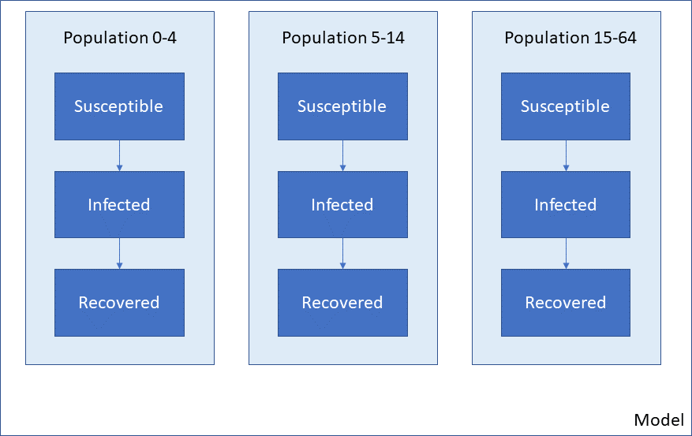

A different Framework, such as one for a different disease, will have a different set of compartments (e.g. different states that a person may be in) but still, all populations have the same cascade:

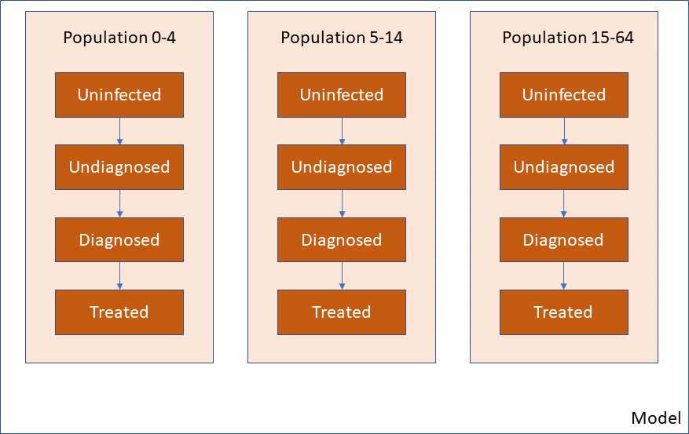

In some cases, however, it would be useful to define populations that have different disease cascades. Three initial example use cases are

- In vector-borne diseases, the disease states of the vector are likely to be different to the disease state for humans. Also, vectors may interact with multiple human populations
- Some diseases may involve the environment (e.g. dynamically varying water pollution)
- Some models may be different cascades for different human populations. For example, a nutrition model may have one treatment cascade for adult women, and a different cascade for young children

This type of scenario is illustrated below. Note that the population type is reflected in the colour of the populations, not the populations themselves. 

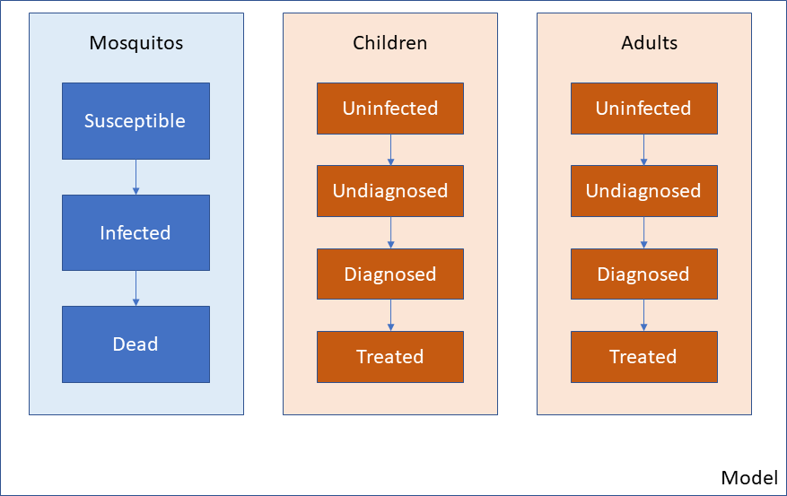

Atomica is able to implement this type of model by using the optional 'Population type' feature. This feature works in the following way

1. You can define several population types in the Framework
2. Each quantity in the Framework (compartment, characteristic etc.) gets assigned to a population type
3. When creating the databook, you need to specify not just the name of the population, but also its type

The result will be a model similar to the one above - that illustrative example corresponds to having two population types in the Framework, and three populations in the Databook. 

The main purpose of having different population types is so that their dynamics can interact when simulating the model. For example, human prevalence might dynamically affect mosquito prevalence in a malaria model. These interactions can be specified in parameter functions in the framework. 

.. caution::

    Transfers assume a 1:1 mapping of compartments between populations. Therefore, it is not possible to have transfers between different population types

The restriction that transfers cannot take place across population types helps to clarify the use cases where population types are appropriate, as opposed to simply adding compartments to an existing cascade.

- There can never be a transfer between a mosquito population and a human population, because this would represent mosquitos turning into humans. Thus, a population type would be appropriate for this
- Similarly, there can never be a transfer between a human population and the environment e.g. a human turning into a lake. Thus, an environment population to track water pollution would be well represented with a different population type
- There may be a separate set of disease states if a model includes coinfection. For example, there may be more possible treatment states for TB+HIV compared to TB or HIV alone. If it is possible for an individual to move from TB to TB+HIV or between other coinfection states, then these should *not* be different population types. Instead, the all of the coinfection states should be added as compartments within a single population type
- Some nutrition models for maternal and child health model adult women and children completely independently, such that no children grow up and become adult women. In these types of models, children simply exit the model once they reach a certain age (e.g. 5 years old). For this type of model, it would be suitable to have separate population types for women and children. That way, stunting and wasting compartments would not need to be created for adults, only children. However, if it is possible for children to become adults within the model, then there should *not* be different population types - otherwise, it would be impossible to transfer people from the child populations to the adult population

.. note::

	The general rule is, population types are suitable if it is not possible to move from one population type to another, different species being the canonical example

Adding population types has effects on the Framework, databook, program book, and plotting. We now discuss each of these in detail. For a worked example, refer to the ``combined_framework.xlsx`` example in the Atomica model library, together with the associated databook and program book. The screenshots below are drawn from this example

Framework population types
--------------------------

The first step to create population types is to fill in the 'Population types' sheet in the Framework. Most frameworks omit this sheet, but it is present in the advanced template when creating a new framework from scratch. The sheet simply defines a code name and description for each population type. 

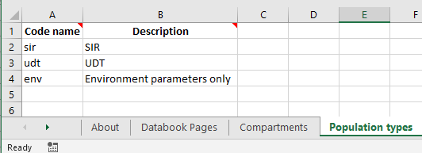

Under the hood, if this sheet is omitted, then Atomica will automatically fill it with a population type named ``'default'``. The default population type is otherwise the first population type listed here. 

Next, each compartment needs to be assigned to a population type. Integration variables (compartments, characteristics, parameters, and links) belong to exactly one population type. The code name for these quantities needs to be unique across all population types in the framework. You can assign the population type by filling in the 'Population type' column

.. image:: framework_2.png
	:width: 650px

If you leave a cell blank, it will be automatically assigned to the first population type on the 'Population types' sheet. 

.. note::

	It is possible to define a population type without any compartments. Such a population type can be useful if you want a storage container for parameters, but don't need to track any entities (e.g. people, mosquitos). For example, an environment population for water pollution would probably have a parameter representing water pollution, rather than a compartment.

Next, do the same for Characteristics and Parameters. 

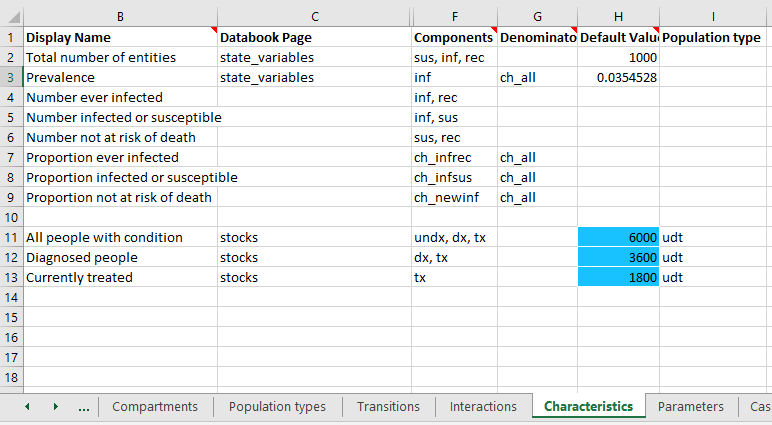

Notice how the characteristics sheet has omitted the population type for the 'sir'-related quantities, which will be automatically assigned because the 'sir' population type is the first one in the list. In general, it is better to explicitly specify the population type for all quantities. However, if there are many quantities and only a few of them belong to a different population type, this default behaviour can make it easier to fill out the Framework.

Note that characteristics cannot span population types - the included compartments and the denominator must all belong to the same population type as the characteristic itself. This is because characteristics are always evaluated within a single population, so all of the constitutents of the characteristic must exist within that population. 

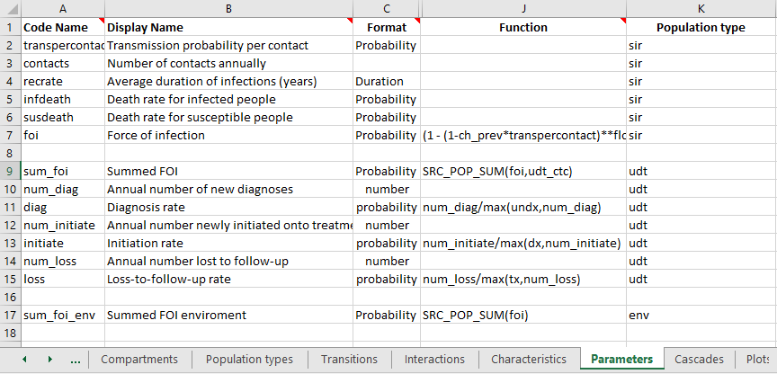

Parameters are where population types become somewhat more complicated. Transfers cannot take place between different population types. Therefore, all interactions between population types take place via parameter functions. As a general rule, when you write a parameter function, all of the quantities you refer to inside the function (other parameters, compartments, characteristics) should be defined within the same population type. This is because standard parameter functions are always evaluated within a single population, so variables from other population types are simply not defined within the population when the parameter function is being evaluated. 

The exception is for cross-population interactions, which are computed via population aggregation functions. You can refer to quantities in other population types within the ``SRC_POP_SUM`` or ``SRC_POP_AVG`` special functions. Note that this does not apply to ``TGT_POP_SUM`` and ``TGT_POP_AVG`` (because this affects the orientation of the interaction matrix - described below). 

The aggregation functions ``SRC_POP_SUM`` and ``SRC_POP_AVG`` support weighting the interaction in two ways

- You can optionally specify a weighting variable. When using population types, the weighting variable must belong to the same population type as the quantity being aggregated (not the population type of the parameter itself). For example, if an environment parameter depended on the number of people in several human populations, the weighting variable needs to be defined in the human populations, not in the environment population.
- The interaction can be weighted by an interaction matrix, defining pairwise interaction weights. This provides fine control over the interactions between specific populations

The interaction matrix is declared on the 'Interactions' sheet in the Framework, in the same way as for standard Frameworks. However, with population types, you also need to specify the 'From' population type, and 'To' population type. 

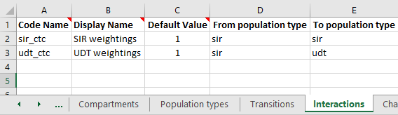

When the databook is generated, an interaction matrix will be defined specific to these population types. The population types need to be specified explicitly because in general, there will be a different number of populations of each type, and therefore the interaction matrix will not be square. This is also the reason for not supporting ``TGT_POP_SUM`` and ``TGT_POP_AVG``, because end users are instructed to complete the databook interactions sheet as being interactions 'from' rows 'to' columns.

If your parameter function refers to an interaction, then the quantity being aggregated must match the 'From' population type of the interaction, and the parameter itself must match the 'To' population type. In the example shown above, the parameter ``sum_foi`` has been declared in the ``udt`` population type. The quantity being aggregated is ``foi``, which is declared as belong to the ``sir`` population type. The interaction is weighted using the ``udt_ctc`` interaction matrix. This interaction is defined as with 'From population type' ``sir`` and 'To population type' ``udt``, which is consistent. It would not be possible to have the parameter function for ``sum_foi`` be ``SRC_POP_SUM(foi,sir_ctc)`` because the population types do not match.

.. tip::
	
	If you want to have an interaction only between certain populations within a population type - for example, if only adults contribute to water pollution - then create an Interaction and set the weights to 0 in the databook for the populations that should be excluded.

The final place population types appear in the Framework is in the transition matrix. Transitions are possible between compartments of the same population type. As a general rule, you should have as many transition matrices as you do population types with compartments. In the example above, there are three population types, but only the ``sir`` and ``udt`` population types have compartments within them. Therefore, we will have two transition matrices. These both appear on the 'Transitions' sheet. To define multiple transition matricies, simply insert them onto the transitions sheet stacked vertically, separated by an empty row. For example:

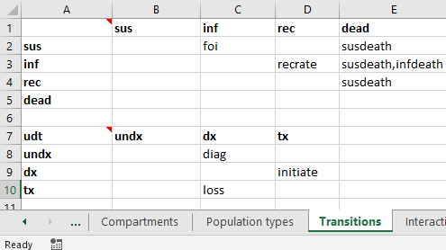

In the top left cell of the transition matrix, enter the code name for the population type. For example, the above screenshot shows 'udt' entered into cell A7. If the population type is omitted, it will default to the first population type in the framework. So the empty cell A1 will be automatically populated with 'sir' in this example. All of the compartments in the transition matrix must have the same type as the transition matrix itself (e.g., with 'udt' in cell A7, the compartment in cell B7 must exist in the 'udt' population type). This is atuomatically checked and validated when the framework is loaded. Similarly, all of the parameters in each transition matrix must belong the corresponding population type. 

Databook population types
--------------------------

The next step in working with population types is creating and filling in a databook. When creating a databook, it is essential to specify the population type of each population being added. This is because the data entry tables will only contain rows for populations where a given variable is defined. For example, you might create a databook with the following population input:

.. code:: python

	pops = {
	    'SIR_0-4':{'label':'SIR 0-4','type':'sir'},
	    'SIR_5-14': {'label': 'SIR 5-14', 'type': 'sir'},
	    'SIR_15-64': {'label': 'SIR 15-64', 'type': 'sir'},
	    'UDT_0-14': {'label': 'UDT 0-14', 'type': 'udt'},
	    'UDT_15-64': {'label': 'UDT 15-64', 'type': 'udt'},
	    }

Notice how every population has both a label and a type. The 'Population Definitions' sheet in the databook now contains an additional column for population type.

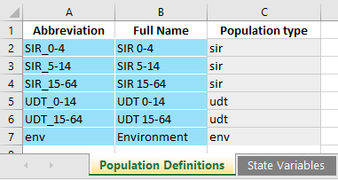

.. warning::

	The data entry rows are created when the databook is generated, and they take into account the population types. It is not possible to change the type of a population after it has been created. The population type cells are grey to reflect this. Changing the population type by overwriting those cells will likely result in an error (unless all of the data entry tables are also updated manually). Instead, you should load the databook into Atomica and programatically remove the old population, and make a new one with the desired type.  

The data entry tables are essentially unchanged from normal databooks where there is only one population type. However, notice that the available populations under each quantity depend on the population type. For example, 'All people with condition' is defined in the 'udt' population type, so data entry is provided only for the UDT populations.

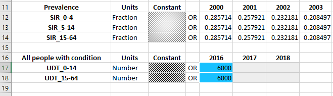

There are no restrictions on mixing quantities in different population types on the same databook worksheet. In the framework, the databook page and databook order are defined the same way across population types. You can mix and match quantities from different population types in the databook, or separate them out if you wish.

Transfers can only take place within the same population type. Therefore, you need to specify the population type for the transfer in the same way you specify the population type for the populations. For example:

.. code:: python

	transfers = {
	    'aging_sir': {'label': 'Aging SIR', 'type': 'sir'},
	    'aging_udt': {'label': 'Aging UDT', 'type': 'udt'},
	    }

Then in the databook, transfers only show populations belonging to the appropriate population type:

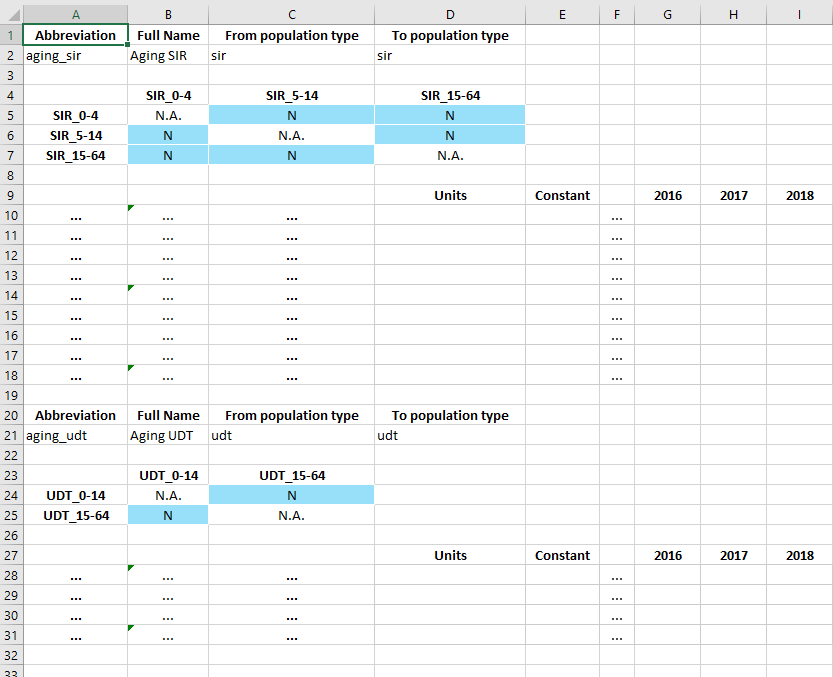

In the example above, the SIR aging transfer shows only the SIR populations, and the UDT aging transfer shows only the UDT populations.

In contrast to transfers, the interactions are permitted to mix population types. Specifically, recall that in the framework, an interaction is defined with a 'From' population type, and a 'To' population type. In the example, we defined the 'utc_ctc' interaction as being 'From' SIR, and 'To' UDT. Thus, the following interaction matrix is shown in the databook

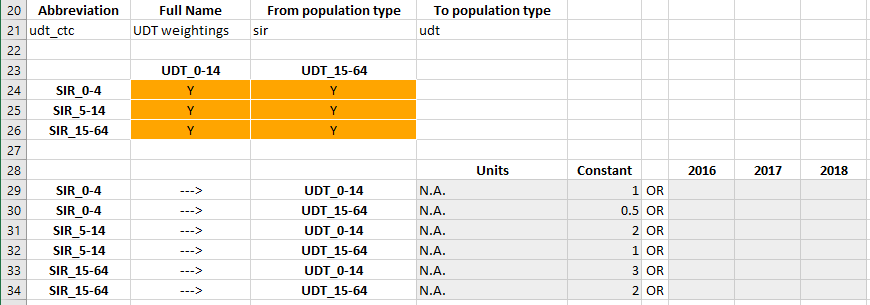

Notice that because there are 3 SIR populations but only two UDT populations, the interactions matrix is not square. 

Programs and population types
-----------------------------

Programs also support population types, but the implementation is relatively simple compared to frameworks and databooks. 

On the 'Program targeting' sheet, all populations and all compartments are shown, regardless of which population type they are in. You can select any population and any compartment to target. The number of people targeted by the program is defined as the sum of all compartments that are targeted by the program. Thus, any nonexistent compartments will simply be skipped in the this summation. Consider the example shown below:

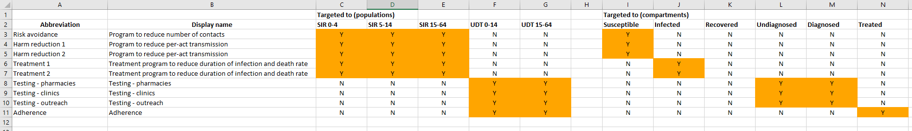

The 'sir' population type has a 'susceptible' compartment, and the 'udt' population type has an 'undiagnosed' compartment. If a program was targeted at the population 'SIR 0-4' and both the 'Susceptible' and 'Undiagnosed' compartments, the number of people targeted would consist only of the 'Susceptible' compartment in the 'SIR 0-4' population. If the program was targeted at both 'SIR 0-4' and 'UDT 0-14',  and both the 'Susceptible' and 'Undiagnosed' compartments, then the number of people targeted would consist of 'Susceptible' in 'SIR 0-4' and 'Undiagnosed' in 'UDT 0-14' (noting that the 'SIR 0-4' population has no 'Undiagnosed' compartment, and the 'UDT 0-14' population has no 'Susceptible' compartment).

The 'Spending data' sheet in the program book is unchanged.

The 'Program effects' sheet is almost unchanged by the addition of population types. However, targeted parameters will only have data entry rows for populations with the appropriate type. 

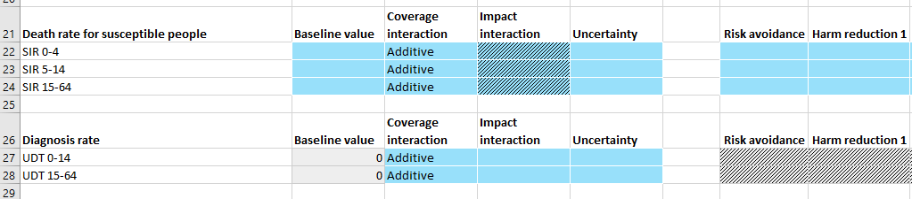

In the example above, 'Death rate for susceptible people' is a parameter in the 'sir' population type while 'Diagnosis rate' is a parameter in the 'udt' population type. Therefore, different populations appear under each parameter.

.. note::

	Programs themselves do not belong to a population type - they simply target compartments and parameters that exist within a model, regardless of whether multiple population types are present.

Any program can target any parameter in a population where that parameter exists. No constraints are imposed on the targeted populations vs targeted parameters, and the same is true for population types. It is possible for a program to target compartments in one population type, but have an outcome on a parameter in a different population type. Similarly, it is possible for a program to target people in multiple population types but only have an outcome in one population type. An example of where this might be useful is in implementing a screening program, where multiple population types might be eligible for screening, but only one _population type_ can be diagnosed (e.g. if your model had a separate population type for PLHIV, then an HIV screening program might target all population types, but it would only have an effect on HIV diagnosis rate in the PLHIV populations). Similarly, this feature allows programs to be implemented that affect multiple population types with different cascades (e.g. children and pregnant women) but where there is conceptual overlap e.g., an anaemia program, that targets and treats anaemia in both children and pregnant women, even though their compartments and transition parameters don't actually match.

Running simulations
--------------------------

Running the model is essentially unchanged. Note that

- ``ParameterSet`` objects contain ``Parameter`` objects, and those ``Parameter`` objects will name populations that depend on the population type. So you cannot assume that all ``Parameter`` instances within a ``ParameterSet`` have the same populations
- Similarly, ``Model`` objects contained within a ``Result`` can have different compartments, characteristics, parameters, and links in each population. Thus you cannot assume that a given quantity (e.g. compartment) exists in all populations

Plotting
--------

As with running simulations, the plotting routines are essentially unchanged. However, the fact that outputs do not exist in all populations adds an additional complication to aggregating outputs. 

.. warning::

	When plotting models where more than one population type is present, you cannot use ``'all'`` or ``'total'`` as shortcuts to aggregate over all populations.

By definition, any given output can only exist in one population type. But also by definition, ``'all'`` or ``'total'`` will aggregate over more than one population type. Thus, at least some of the populations will fail to contain the output. In cases where there are no output aggregations, it is possible to infer which population an output belongs. However, it is possible to also aggregate outputs. In cases where there are multiple output aggregations, it is technically challenging to make reasonable assumptions about which plots to generate; more importantly though, it is exceptionally difficult for users to infer the plot output beforehand. Further, it is possible to specify multiple population aggregations. These could specify an aggregation over different population types. The resulting values could then be stacked in a bar graph. However, this would result in methodologically incorrect plots in many cases, particularly when population types are used to represent different species. 

Plot data generation is already very complex, with support for output aggregations, population aggregations, and time aggregations. Therefore, to improve consistency, predictability, and interface simplicity, we maintain the existing logic within ``PlotData`` that all requested outputs exist in all requested populations. Although inconvenient, this makes it much easier to deal with the logic of aggregations and bar plot stacking. In particular, it prevents users from performing aggregations across population types. Although this prevents operations such as aggregating over children and adult women within the ``PlotData`` constructor, it also prevents things like aggregating over humans and mosquitos - the former is an inconvenience (and modifying the ``PlotData`` instance after construction is a simple workaround), but the latter is simply wrong. 

In practice, in application scripts, it is simply a case of maintaining a list of populations of a given type, and passing that in as the population for ``PlotData`` instead of writing ``'all'``. 
