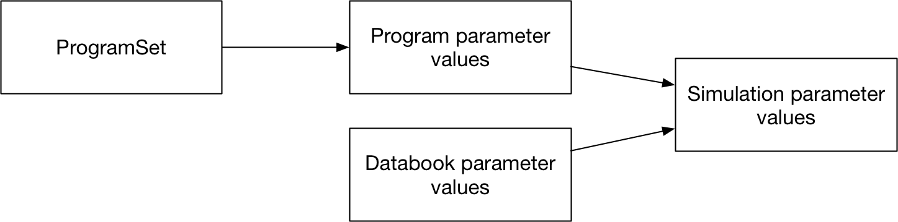
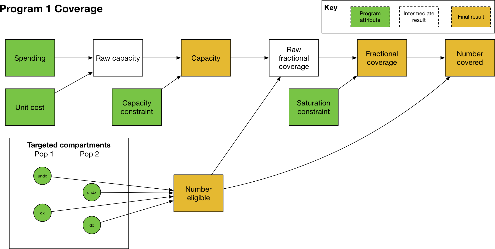
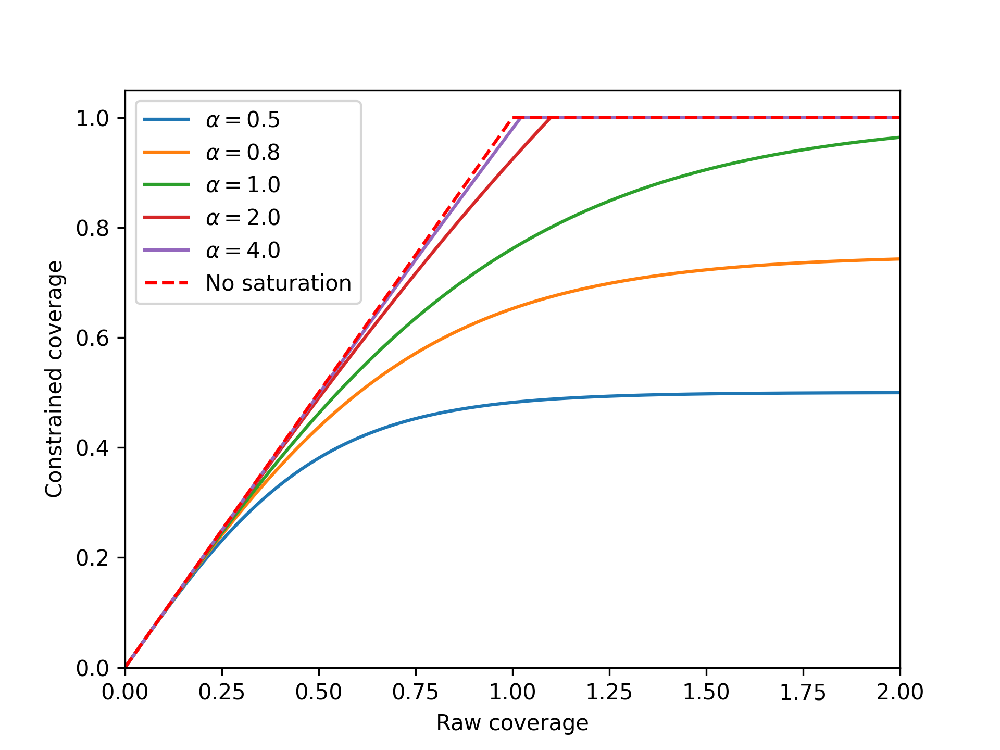

Program System
##############

The role of the programs module is to produce simulations in which spending on programs has been used to compute the parameter values driving transitions between compartments in the model. An overview is shown below:

The way this is achieved is by the ProgramSet overwriting the parameter values during integration. While the model is being run, if programs are active, then program-generated parameter values are used to overwrite the relevant subset of databook (calibrated) parameter values.

The general workflow is that a country spends money on one or more programs. Each program is targeted at a set of compartments. The amount of investment in a program affects how many people are reached by the program. A program also has one or more effects on model parameter values for individuals that are reached by a program. The parameter value depends on the coverage of the program - for example, in a diagnosis program, the number of people diagnosed would increase as the coverage of the program increases. So the process of calculating parameter values is to first map spending to coverage, and then to map coverage to outcomes.

If multiple programs target the same people, then it is possible for complex interactions between them to take place. Therefore, the program overwrites are normally computed for an entire collection of programs at once (via a :class:`ProgramSet`), which enables computation of any interactions between programs.

Data and structural overview
============================

The key data associated with programs is all entered into the *program book*. A program book can be thought of as an Excel data-based representation of a ProgramSet. The program data is divided into three sheets. 

Programs are targeted at a subset of available compartments and populations. A simple example is shown below, with two programs each targeting different compartments in the model.

This information to specify targeting is entered on the *Program targeting* sheet, which specifies

- The list of programs in the ProgramSet
- The populations available for targeting and which populations each program targets
- The compartments available for targeting and which compartments each program targets

An example is shown below:

.. image:: progbook_1.PNG
	:width: 700px

Note that

- A program must reach the same compartments in every population tions
- To define the *unit cost* of the program, which determines how margeted. For example, it cannot target susceptible and vaccinated in children and only susceptible in adults. 
- When running a simulation, a :class:`Project` loads in a framework file, a databook, and a program book. The compartments listed in the program book must match those defined in the framework file, and the populations listed in the databook must match those defined in the databook. In practice, these three Excel files tend to be stored together and replicated for each application being run. 

The second program sheet defines quantites related to computing program coverage. As mentioned above, program coverage is computed based on spending. While more detail is provided below, the key steps required are

- To define the amount of money that is spent on each program - the program book provides data entry for historical spending values, while model simulations use proposed spending values to compute future projectany people are reached for a given amount of money
- In addition, optionally specify constraints on program coverage. These take the form of supply-side constraints, such as external limitations on program capacity (e.g., available hospital beds or drug production limitations), or demand-side constraints, such as a certain portion of the population being impossible to reach or more expensive to cover. 

An example of this *spending data* sheet is shown below:

.. image:: progbook_2.PNG
	:width: 600px

Notice also that all values can be time-varying and can contain uncertainty. 

Finally, the last program sheet - the *Program effects* sheet - defines the effect that each program has on model parameters. An example is shown below:

.. image:: progbook_3.PNG
	:width: 900px

This sheet contains a table for each parameter targeted by the ProgramSet. Typically, this is the set of programs that is marked as 'Targetable' in the framework, and is thus independent of whether any programs in the ProgramSet actually target the parameter. For each parameter, the program outcomes in each population are independent. Interactions between programs are covered in more detail below. In summary, the columns on the right specify the effect of each program on individuals reached by the program in isolation. If more than one program targets the parameter (i.e., if there is more than one program effect value in a single row) then the 'coverage interaction' column determines how many people are reached by more than one program, and the 'impact interaction' determines the effect of a combination of programs.  

When the program book is loaded in, these data are stored in three key classes

- A :class:`ProgramSet` contains a collection of :class:`Program` objects and a collection of :class:`Covout` objects
- A :class:`Program` object contains all of the information on the 'Program targeting' sheet and the 'Spending data' sheet. There is one program object for each row in the 'Program targeting' sheet
- A :class:`Covout` object contains all of the information on a single row of the 'Program effects' sheet. It thus contains all of the program outcomes for a single parameter in a single population. Storing the program outcomes grouped by parameter rather than grouped by program facilitates computing interations between programs. This process is described in more detail below - :ref:`Outcomes`. 

This class structure is depicted visually below:

Again, the key point to note in the figure above is how data storage is split across the :class:`Program` objects and :class:`Covout` objects.

As outlined above, the broad strategy for mapping spending to parameter values is

1. Use spending to compute program coverage
2. Use program coverage to compute program outcomes

We now go through each of these stages in turn.

Coverage computation
====================

Computing program coverage is performed independently for each program. In discussing program coverage, we introduce the following terms:

- The *capacity* of a program is the maximum number of people that can be covered by the program
- *Number eligible* or *Eligible people* are the people in populations and compartments targeted by the program. In some contexts, this quantity may be referred to as the 'coverage denominator'
- The *fractional coverage*, *proportion coverage*, *fraction covered* all refer to the fraction of eligible individuals reached by the program
- The *number covered* or *number coverage* refers to the number of individuals reached by the program, and is equal to the fraction covered multiplied by the number of eligible people

The calculation of program coverage proceeds as follows:

1. Use spending, unit cost, and the capacity constraint to calculate the program's capacity
2. Use the capacity, number of people eligible for the program, and saturation constraint to compute the fraction covered

Capacity
--------

The capacity of a program (in some contexts, referred to as the 'coverage numerator') can be thought of as the maximum number of people that could be reached by an intervention for a given budget. For example, it might correspond to the number of doses of a treatment that can be purchased with the available funds. There are fundamentally two types of programs

- One-off programs, in which a cost is incurred every time a person is reached by a program (e.g. the cost per dose of a treatment)
- Continuous programs, in which a cost is incurred over a period of time for a person being reached by the program (e.g. the cost of providing ART to a person for a year)

The key difference between the two is that if a program reaches 100 people per year, and the simulation timestep is 0.25 years, then the 100 people reached by the one-off program are distributed throughout the year, and in the first quarter only 25 people can be reached by the program. In contrast, the continuous program would reach 100 people in every quarter.

In terms of differentiating the two types of programs, spending on programs is always provided as '$/year'. The capacity of the program is the total spend, divided by the unit cost. For one-off programs, the unit cost is provided as '$/person' and thus the capacity would be defined in units of 'people/year'. For continuous programs, the unit cost is provided as '$/person/year' and thus the capacity would be defined in units of 'people'. 

The capacity constraint serves as a hard upper limit on the capacity. It can be entered in units of 'people/year' or 'people' and it will be converted automatically between these two representations using the timestep, if required. In general, the capacity constraint should be entered in the same native units as capacity, so for one-off programs, it should be entered in units of 'people/year' and for continuous programs, it should be entered in units of 'people'.

Coverage
--------

The next step is to calculate the program's coverage. Here, we are principally focused on computing the fraction (of targeted people) covered. Program coverage is computed in three steps

1. The raw fraction covered is computed by dividing the program capacity by number of eligible people
2. If present, a nonlinear saturating constraint is applied
3. The fractional coverage is capped at 1.0

To obtain the raw fraction covered, first the number of eligible people is determined. For each population targeted by the model, the number of people in the targeted compartments is summed. These are then summed across populations. The result of this operation is the *number eligible*. Note that this calculation is performed in ``model.py`` and the ProgramSet/Program methods take in the number eligible as an input (rather than computing them internally). This arrangement improves performance by allowing :class:`Model` objects to efficiently cache the compartment objects required to compute the number eligible.  

Then, the program capacity is divided by the number eligible to get the raw fraction covered. For the units in this operation to match, the program capacity must be in units of 'people' rather than 'people/year'. For a one-off program, the capacity therefore needs to be multiplied by the simulation timestep prior to performing this calculation. So for example, with a total spend of 1000 ($/year) and a unit cost of 10 ($/person) the capacity would be 100 (people/year) and with a timestep of 0.25, in the first quarter, the capacity would be 100*0.25 (people), which is the required result for a one-off program. This conversion is performed automatically during the calculation when required. 

By default, fraction coverage increases linearly before being capped at 1.0. If a saturation constraint is present, the raw fraction covered is passed through a nonlinear saturating function. Here we use the term 'raw fraction coverage' to refer to the fractional coverage prior to applying the saturation constraint - in practice, the saturation constraint is applied in the same step as coverage computation, so the 'raw fractional coverage' is never exposed.

The saturation function is a function of a single parameter :math:`\alpha` (the maximum coverage value) and is implemented as:

.. math::

   y = \frac{2 \alpha}{\left( 1+ \exp(-2x/\alpha) \right)} - \alpha

This function takes in the raw fractional coverage :math:`x` and applies a nonlinear transformation that maps coverage onto the range :math:`[0,\alpha)`. Finally, this saturation-constrained coverage is clipped so that it never exceeds 1.0 - and we refer to this final result as the 'fraction covered'. 

The effect of the saturating function for different saturation values is shown below. The red dashed line shows linear coverage with no saturation. 

The form of the function above means that coverage asymptotically approaches the saturation value as raw fraction covered increases to infinity. The raw fraction covered can exceed 1.0 - this happens if the program capacity is greater than the number of people eligible. For the standard linear coverage operation, once the capacity exceeds the number of people eligible, the coverage value is clipped to 1.0 and there is no difference in the final fraction covered as the raw coverage increases further. When saturation is present, if the raw fraction covered is exactly 1.0, then the final fraction covered will be *less* than the saturation value, because coverage only asymptotically approaches saturation. Thus a program needs to be considerably over-funded relative to the unit cost in order to have a fraction covered approaching saturation. This is effectively the same as the unit cost increasing as more and more people are covered, which is how nonlinear coverage saturation is traditionally framed (i.e. it becomes more and more expensive to reach the final portion of the population). In fact, at any point on the curve, the effective unit cost is equal to the actual unit cost divided by the gradient of the cost-coverage curve. A saturation value of 1.0 is still fairly nonlinear. As shown in the example above, it is possible to set a saturation value greater than 1 to make the saturating function more linear. The standard linear coverage function is actually the limit of the saturating function as the saturation value approaches infinity. Thus there is considerable flexibility to manipulate the shape of the nonlinear saturation even though it is governed by a single parameter. 

A final comment is that in many cases, the fraction covered will simply be the program capacity divided by number eligible. It can therefore be tempting to think of the program capacity as being the 'coverage numerator'. However, this interpretation can be confusing, because if the number of eligible people is smaller than the capacity, or if saturation constraints are present, then the fraction covered cannot simply be obtained by dividing capacity by number eligible. Hence we prefer the terminology 'program capacity' and 'number eligible' to 'coverage numerator' and 'coverage denominator', because the former terms are formally defined within our framework and are not context-dependent.

Number covered
--------------

The number covered is effectively an output that follows directly from the fraction covered - it is obtained by multiplying the final fraction covered by the number of people eligible. The number covered therefore corresponds to the number of people that are actually reached by the program, after taking into account

- Capacity constraints
- The number of people eligible for the program (as this depends on the compartment sizes, it is only known during/after simulation)
- Any saturation constraints/saturation nonlinearity

In contrast, the program capacity takes into account capacity constraints but is *not* limited by the number of people eligible. To illustrate these different quantities, consider the following example of a treatment program: a treatment program is funded with $1000 for drugs costing $10/person treated. There are 50 treatments available for purchase in the country. Therefore, the program capacity is 50, because the raw capacity is 100 treatments, and it is limited by the capacity constraint. It turns out that in the hospital there are only 25 patients, so there are only 25 people are eligible for treatment. The fraction covered is 1.0 because every person eligible for treatment received treatment. The number covered is 25 people, because 25 people received treatment. 

Note that the number covered does not actually enter into the computation of parameter values - it is the fraction covered that is used in the outcome computation described below.

Outcome computation
===================

The final stage of programs computation is the mapping of program coverage to outcome. This is handled via the :class:`Covout` object, which implements functionality related to coverage overlap and impact interactions. The overall workflow is shown below:

At its core, the mapping from program coverage to outcome is linear, with the form

.. math::

   y = (a-b) c + b

where :math:`y` is the computed value of the parameter, :math:`a` is the program outcome with 100% coverage, :math:`b` is the baseline value (the parameter value with no coverage), and :math:`c` is the program's fractional coverage. Thus it can be seen that for 0 coverage, the parameter has the baseline value, and for 100% coverage, the parameter has the maximum outcome value. For single programs in isolation - where the coverage :math:`c` refers to people covered by that program only - the maximum value :math:`a` is the value entered in the program book. The calculation is thus very straightforward, with the value of :math:`c` being equal to the program's fractional coverage. 

One very subtle distinction is that the :class:`Covout` object is specific to a single parameter in a single population, and the coverage at this point is technically the coverage of the people affected by the *parameter* rather than coverage of people targeted by the *programs*. When working with fractional coverage, the two are equal, and the computations shown above are all performed with fractional coverage. However, this distinction can become important for transition parameters if they are in number units and if a program targets a different set of compartments to those associated with the transition - see :ref:`Parameters in Number units` for an example of this.  

The situation becomes more complex when more than one program targets the same parameter in the same population. This happens if there is more than one non-empty item in the same row of the program effects sheet. In that case, the same linear mapping between coverage and outcome is used, but rather than being performed for single programs, it is performed for sets of programs. For example, if we have Program 1 and Program 2 both targeting the same parameter, we would have an additional calculation :math:`(a-b) c + b` in which :math:`c` is the proportion of the population reached by both Program 1 and Program 2, and :math:`a` is the outcome of being reached by both programs simultaneously. The number of interactions is exponential in the number of programs, and is equal to :math:`2^n` where :math:`n` is the number of interacting programs - for example, if there are 4 programs, then there are 16 different combinations of those 4 programs. The outcome calculation is performed for all relevant combinations (those where the coverage is not zero) and the outcomes are summed. For each combination, two calculations must be performed

1. First, we need to calculate how many people are reached by that combination of programs (determined by the coverage interaction)
2. Then, we need to calculate the outcome of being reached by that combination of programs (determined by the impact interaction)

We now go through each step in turn

Coverage interaction
--------------------

Each program has a fractional coverage value that represents how many people are reached by that program, irrespective of whether they are reached by any other program. We have to decide how many people are reached by each combination of programs, and Atomica provides three possibilities for how this can be carried out. As noted above, the coverage interaction is computed for a single parameter at a time, and it is assumed that the overlap in coverage is taking place within the same group of people for all programs, even if those programs are targeted at different compartments (i.e. it is taking place within the group of people relevant to the parameter, which is the same for all programs targeting that parameter). This step is described in more detail below, in the ':ref:`Parameters in Number units`' section. 

The three possible interactions are

- Random
- Nested
- Additive 

The **random interaction** means that the programs target individuals independently of each other, so if Program 1 has a coverage of 0.5, and Program 2 has a coverage of 0.3, then the number of people covered by each combination of programs is:

- No programs: ``(1-0.5)*(1-0.3)``
- Program 1 and not Program 2: ``(0.5)*(1-0.3)`` 
- Program 2 and not Program 1: ``(1-0.5)*(0.3)``
- Program 1 and Program 2: ``0.5*0.3``

An example with three randomly interacting programs is shown below. The percentages indicate the fraction of the total group of eligible people that is covered by each combination of programs. For example, the figure shows

- 24% of people are not reached by any program
- 24% are reached by Program 1 only
- 6% are reached by Program 3 only
- 6% are reached by Program 1 and 3 and not Program 2

Notice how the coverages for each program add to the individual program values - for example, the total percentage of people covered by Program 3 is ``6%+6%+4%+4%=20%`` which is the expected the fractional coverage for Program 3. 

The random interaction assumes that there is no interaction in targeting between programs. In contrast, the nested and additive interactions correspond to specific assumptions about how programs are jointly targeted. The **nested interaction** maximizes overlap in coverage by having individuals be covered by as many programs as possible. Thus the programs are 'nested' such that anyone covered by a given program is also covered by all other programs that have a larger fractional coverage. As shown in the diagram, Program 2 has a smaller coverage than Program 1, so Program 2 is only targeted at people that have also received Program 1. Similarly, Program 3 has smaller coverage than Program 2, so Program 3 is only targeted at people that have also received Program 2. 

Finally, the third type of modality interaction is **additive interaction**. Additive interaction minimizes the people that are covered by no programs by minimizing overlap in coverage. As long as the sum of the fractional coverages is less than 1, there will be no overlap between programs, as shown below:

.. image:: coverage_additive.png
	:width: 600px

This additive interaction is trivial if the sum of coverages is less than 100%. However, the situation is more complex if the total coverage exceeds 100%. In that case, the calculation proceeds as follows

1. First, people are reached by the most effective programs, until coverage of 100% is reached. The effectiveness of a program is quantified by the size of the difference between the baseline parameter value and the program's outcome value. 
2. After coverage of 100% is reached, any remaining coverage is applied randomly within the population

This calculation is illustrated below

In this example, Program 1 is the most effective program, followed by Program 2 and then Program 3. Because Program 1 and Program 2 have coverages that sum to less than 100%, those two programs are combined purely additively. That is, there is no overlap between Program 1 and Program 2 in the figure above. The remaining 10% are covered by Program 3 only. Afterwards, 100% of the population has been covered by one program, and there is 10% coverage for Program 3 remaining. This coverage is distributed randomly throughout the population, which results in 6% of the population being covered by Program 1 and Program 3, and 4% being covered by Program 2 and Program 3. This preferential additive algorithm means that as coverages increase, outcomes should always improve.

Impact interactions
-------------------

Finally, having computed the fraction coverage of the combination of programs, we need to compute the outcome for individuals covered by that combination of programs. This can be specified in one of three ways in the Excel spreadsheet, which leads to three different cases in the code. 

First, the impact interaction cell can be left empty. In that case, the impact of the combination of programs is equal to the impact of the program with the largest effect - effectively, individuals receive the 'best' outcome of all individual programs. The best outcome is defined as the one that has the largest difference (positive or negative) between the outcome value and the baseline value, which means that this behaves correctly regardless of whether the effect of a program is to increase or decrease the parameter value. 

Second, the impact interaction can explicitly state the program outcome for the combination of programs. For example, suppose the program book has programs "BCG", "PCF", and "ACF". Then, the impact interaction can contain a string like "BCG+PCF=0.4" which specifies that the outcome for being covered by both BCG and PCF is 0.4. Multiple outcomes can be provided, separated by commas - for example, "BCG+PCF=0.4,BCG+PCF+ACF=0.5". If a combination does not appear explicitly in this string, then it will fall back to the 'best' outcome described above. One edge case occurs if programs have disparate effects on the parameter value, such that one program increases the value relative to baseline, and another decreases it. In that case, the 'best' outcome will be the one that has the largest difference to baseline, so whether the parameter value is increased or decreased depends on the specific values provided as program outcomes. In such cases, it may be preferable to explicitly specify the outcome in the impact interaction to avoid ambiguity. 

Parameters in Number units
--------------------------

The programs system is based on computing parameter values by multiplying the program outcome by the program's fractional coverage. This is all that is required for parameters that are in units of probability. However, in some cases, the parameter being overwritten may be in number units - for example, if the framework defines the treatment initiation rate as a number of people rather than a probability. In that case, an additional conversion step is required. The conversion is performed automatically in ``model.py`` by multiplying the parameter value by the number of people in the parameter's source compartments (the sum of all source compartments for transitions associated with the parameter). In practice, this means that in the program book, program outcomes should simply be entered as the outcome for an individual. 

To illustrate how this calculation works, consider a simple diagnosis setup. We have three compartments, susceptible, undiagnosed, and diagnosed. People flow from susceptible to undiagnosed by acquiring the condition, and then from undiagnosed to diagnosed by a parameter ``diag`` that governs the diagnosis rate. For this example, the parameter is specified in number units (i.e. the number of people diagnosed per year). Suppose further that there are 2000 people in the susceptible compartment, and 1000 people in the undiagnosed compartment. Finally, we will assume that the diagnosis intervention is ideal in that there are no false positives or false negatives. Then, administering a diagnosis test to someone that has the condition is guaranteed to result in a diagnosis. So we enter the program outcome for diagnosis as 1.0. 

First, consider the case where the program is targeted at the undiagnosed compartment only (Case 1 in the figure above). Intuitively, all 200 people reached by the program are within the undiagnosed compartment, so there are 1000 people eligible for the program, all of whom are undiagnosed, and the program's fractional coverage is 20%. 

The relevant :class:`Covout` object is specific to the ``diag`` parameter. The covout parameter's fractional coverage is the same as the program fractional coverage, so it too is 20%. The outcome value associated with the covout is given by multiplying the fractional coverage by the program outcome, so it is ``0.2*1.0 = 0.2``. Because the parameter is in number units, we compute the 'source popsize' of the parameter by summing all of the source compartments associated with the parameter - in this case, that is just the ``undx`` compartment. So the value of the parameter is given by ``0.2*1000=200`` and we have a program-computed value of 200 people diagnosed. This value is timestep specific and is converted to an annual value of people/year automatically.

.. caution::

	Note that because the 'source popsize' is computed using the source compartments for all transitions associated with a parameter, it can only be computed for transition parameters that have links associated with them. If a parameter in number units is targeted by a program and is *not* a transition parameter, the fraction outcome cannot be converted to a number of people. In that case, an informative error will be raised.

Now, consider the case where the program is targeted at both susceptible and undiagnosed people (Case 2 in the figure above). This case is similar to a screening diagnosis where asymptomatic individuals are tested, and only those who have the condition test positive. Intuitively, of everyone that might be screened, there are twice as many people without the condition as with the condition. So if the tests are randomly distributed throughout the population, we would expect that of the 200 tests performed, only a third of them would be given to people with the condition, so only 67 tests would be positive (and thus there would only be 67 diagnoses). 

The calculation proceeds as follows - the program is targeted at both ``sus`` and ``undx`` so the number of people eligible for the program is 3000. The fractional coverage of the program is therefore ``200/3000=0.067``. The fraction coverage of the *parameter* is thus 0.066. However, the source popsize of the parameter is 1000, not 3000. The parameter outcome is still 1.0. Therefore the final parameter value is ``0.066*1.0*1000=67`` which is the required number of people. 

Note that the parameter outcome of 1.0 reflects the fact that the test produces no false negatives. If the test only had a 50% chance of returning a positive result, then in both cases the outcome value should be set to 0.5, which will result in the expected number of diagnoses of 100 and 33, respectively. The outcome should be entered in the program book as the outcome *for people eligible for the transition*. The only people eligible for the transition are those belonging the source compartments associated with the parameter. So in the second case, the outcome for the 'diag' parameter is entered as 0.5 which is the probability that someone who has the condition tests positive, even though the program is also targeted at people who don't have the condition. 

Finally, note that in the case where there are multiple programs, the program coverages may all have different denominators depending on their targeting. This is particularly relevant when modelling modalities where the same intervention might be delivered with differences in the specificity of targeting leading to different cost efficiencies. In that case, the program fractional coverages will all have different denominators. However, since the covout/parameter fractional coverage is equal to the program fractional coverages, they can still be combined and added. This is possible because even though the programs are targeted differently, the coverage interaction calculation is specific to the parameter and formally we are combining the 'covout coverage' rather than the 'program coverage'. So for example, if Case 1 and Case 2 above were actually different programs and were both present in the same simulation, we would simply perform the coverage interaction with fractional coverages of ``0.2`` and ``0.066``. 

This is depicted visually above, assuming that the coverage interaction is additive, and we correctly recover the expected result that 267 people would be diagnosed. 