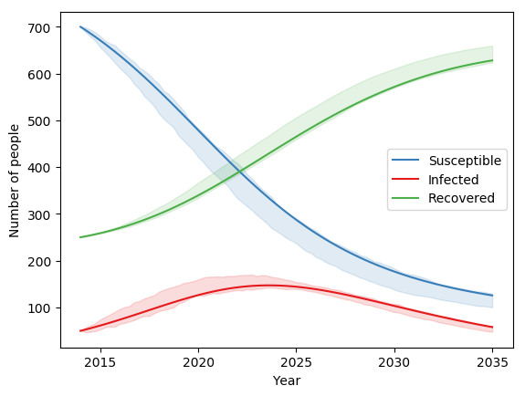

Stochastic models
#################

Within Atomica, there are two ways of getting an Ensemble of results - that is, a collection of simulations that have been sampled in some way

- Uncertainties in the inputs, such that each simulation has a different input that has been sampled from some distribution
- Stochasticity in the model itself, such that each time the simulation is run with the same inputs, a different result is observed

Uncertainties in the inputs can be included by specifying uncertainties in the databook and program book, and is discussed in detail on the Uncertainties page in the documentation. Stochastic models on the other hand, are implemented in the framework by including a call to a random number generator within a parameter's function.

Atomica exposes two of Numpy's random number functions for use in parameter functions

- ``randn`` which maps to ``numpy.random.randn``, returning a random number from a Gaussian distribution with zero mean and unit standard deviation
- ``rand`` which maps to ``numpy.random.rand`` and returns a random number from a uniform distribution between 0 and 1

The output of these functions can be transformed to produce other distributions. For example, to sample from :math:`N(\mu, \sigma^2)`, use ``sigma * np.random.randn(...) + mu``.

After including either the `randn` or `rand` function in the framework, running the model via ``Project.run_sim`` will produce different results each time. Therefore, it is necessary to sample over model runs, even if no uncertainties have been specified. For example, to run the stochastic test included with Atomica, you could use the following approach: ::

    F = at.ProjectFramework("framework_stochastic_test.xlsx")
    P = at.Project(name="test", framework=F, do_run=False)
    P.load_databook(databook_path="databook_sir_dynamic.xlsx", make_default_parset=True, do_run=False)
    ensemble = at.Ensemble(mapping_function=lambda x: at.PlotData(x), baseline_results=baseline)
    ensemble.run_sims(P,'default',n_samples=100,result_names='default')
    fig = ensemble.plot_series()

This would produce a plot similar to the following:

The same ensemble-based approach can be used when uncertainties are present - the same examples in the uncertainty documentation will still work, but there will be an additional source of stochastic effects from the framework. However, you may find that more samples are required to obtain accurate estimates of distributions in the results.

There are a number of possible uses of stochastic models. Aside from adding an additional source of variability to the data, they could be combined with other truncations such as the minimum and maximum functions, or limits on the Parameter values specified in the Framework. This opens the possibility of randomly initiating epidemics (even if the prevalence is initially 0) or modelling eradication, where prevalence drops to 0.

Note that there is an interdependency between the size of the random perturbations and the step size. For a random-walk type process, the size of the random perturbations needs to increase when the step size is increased, but it does so nonlinearly, scaling with the square root of the step size.