Timed transitions
#################

Motivation
**********

In Atomica, compartments typically correspond to states than an individual can be in. Often, in reality an individual needs to spend a certain amount of time in a particular state. For example, a particular treatment might have a certain duration, or an asymptomatic initial infection state might last for a particular amount of time. In a compartment based model that has reached a steady state, the inflow of people into a compartment is equal to the outflow. In that case, the equilibrium value of the compartment is equal to the duration. For example, suppose a compartment has an inflow of 100 people/year. If the duration is 5 years, the equilibrium value would be 500 people - each year, 100 people arrive and 100 people leave, so on average, it takes 5 years to leave the compartment.

This approach is widely used and is entirely valid in the steady state. In the steady state, the arrival times of people in the compartment can be considered uniformly distributed over the compartment's duration, so randomly selecting a portion of people to move out of the compartment results in the correct number of transitions. This assumption breaks down when inflow to the compartment varies over time. Because the true arrival time is not tracked, it's possible for someone to enter the compartment and immediately leave it in the next time step. This is reflected in the fact that the duration of a particular compartment is really an average duration, not a strict duration. 

In most circumstances, the standard compartment assumptions are sufficiently satisfied for the model to produce results within required tolerances. In particular, the fact that the duration assumptions are not exactly met is of secondary importance either when the inflow and outflow is approximately matched (typically when the inflow is significantly smaller than the compartment's size, which implies that the inflow has only a small effect on the outflow) or when the compartment's duration is short (e.g. a few timesteps).

There are some circumstances however, when both of these requirements are grossly violated. In that case, the model does not produce usable results. A common example would be mass vaccination campaigns. In that case, the proportion of people vaccinated changes very quickly, e.g. from 0% to 70% in a single year. Further, the duration of protection of vaccines tends to be quite long, for example, 5 years. In a simulation with quarterly timesteps, this would correspond to 20 timesteps. We might model this as vaccination moving people from a 'susceptible' compartment to a 'vaccinated' compartment, and protection wearing off as a transition from 'vaccinated' back to 'susceptible'. However, if we simply used the standard compartment assumptions, then people would be allowed to transition from 'vaccinated' to 'susceptible' immediately after being vaccinated. In this example, it is particularly noticable because the initial proportion vaccinated was 0% - therefore, it is obvious that *nobody* should lose their vaccinated status until after 5 years. Further, the dynamics of the simulation would be significantly affected because the proportion vaccinated was very large (70%). Finally, if the mass vaccination is a temporary program (e.g. 1 year long) then the vaccination rate changes rapidly (from 0, to 70% of the population, then back to 0) over just a few timesteps. The standard compartment assumptions will not produce useful projections in these circumstances, so a different approach is required. To address this, Atomica implements **timed compartments** that explictly track arrival times, and allow transitions to take place only after a period of time has elapsed.

Use cases
---------

Timed compartment should generally **not** be used when there is a constant inflow/outflow, or if inflows and outflows are slowly changing, even if there is a 'duration' associated with the state. In a compartment model, the amount of time people spend in the compartment follows an exponential distribution. In the steady state, only the mean matters. When things change rapidly, then discrepencies can occur. These discrepencies are largest if the compartment has a long expected duration relative to the step size, and if the inflow changes dramatically. Therefore, timed compartments are typically suitable under the following circumstances

- The expected time in the compartment is long relative to the step size (e.g. >4 timesteps), and
- At the end of the duration, all individuals transition to the same compartment (although this could be a junction), and
- There are sharp changes to inflow or outflow

Two examples of where this usage might be appropriate:

- A mass vaccination schedule where

    - A large proportion of the population is vaccinated at the same time
    - The duration of protection is several years
    - At the end, all uninfected individuals return to the susceptible compartment

- TB early to late latent states

    - The time spent in the early latent state is several years
    - At the end, all infected individuals progress to late latent
    - The inflow changes rapidly if the force of infection changes due to interventions e.g. treatment scale-up reducing the number of new infections

One example of where this usage would be inappropriate

- Treatment lasts 6 months

    - The expected time spent in the compartment is only 1-2 timesteps, so the approximation that the time spent in the compartment by individuals is uniformly distributed is sufficiently good even if the treatment initiation rate changes rapidly

.. caution::

	Timed compartments add complexity and decrease performance. They should mainly be considered when **both** of these conditions are met:

	- The inflow into the compartment has extremely large, rapid changes
	- The duration of the compartment is much longer than the simulation timestep

Basic implementation
********************

Fundamentally, timed compartments leverage the fact that in Atomica, an individual must spend at least one timestep in each compartment (except for junction compartments) because new arrivals to a compartment are not eligible to move out of the compartment in the same timestep. Thus, we can explictly model a duration within the standard Atomica framework as a chain of compartments, where there are multiple compartments corresponding to a single state. For example, consider the case where a state lasts for 1 year, and there are quarterly timesteps. This could be set up as shown in the top part of the figure below:

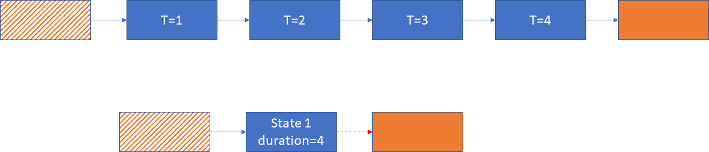

Instead of one compartment for the state, there are 4 compartments. People arrive at the 'T=1' compartment on the left of the figure. Each timestep, they move to the next compartment in the chain. After 4 compartments (corresponding to one year), they then leave the state. This is essentially the implementation of timed compartments - after a period of time has elapsed, all people in the timed state (blue boxes) are forced to move out to a different state (orange). This movement out of the state at the end of the duration period is referred to as 'flushing'. 

Although the chain of compartments at the top is functional without needing any additional functionality in Atomica, it is undesirable for two reasons. First, it would add significant complexity to the model framework, where single states could have many replicated compartments. And second, it introduces a coupling between the framework and the simulation step size, because the number of compartments required depends on both the duration and the simulation step size. 

Therefore, timed compartments are implemented as the bottom sequence shown below. 'State 1' is a single compartment in the framework file. The framework then specifies a special 'timed' duration parameter, that links 'State 1' to the orange compartment. The parameter is a 'timed' parameter, and the link from state 1 to the orange state is referred to as the 'flush link'. If the value of the parameter is 1 year and the simulation time step was 0.25, the duration of the compartment would then be 4 time steps. Internally, the model would be expanded into the top sequence of compartments. However, now the simulation step size can be freely changed, and further, the duration can also be easily modified in the databook. 

.. note::

	- A 'timed parameter' is one that is marked with a 'y' in the 'Timed' column of the framework
	- A 'flush link' is a transition goverened by a 'timed parameter'. There can only be one flush link per compartment. After the duration period has expired, all individuals that have been in the compartment for the specified duration are moved out of the compartment via the flush link. The figure shows the flush link as a red dashed arrow.
	- A 'timed compartment' is a compartment that has a flush link
	- The 'flush state' is the compartment that the flush link transfers people to
	- The 'initial subcompartment' is the 'compartment' where new arrivals enter (the 'T=1' compartment in the figure above)
	- The 'final subcompartment' is the 'compartment' from which people are flushed after the duration period has elapsed (the 'T=4' compartment in the figure above) 

Initialization
**************

When initializing a timed compartment, the initial value is uniformly distributed over the subcompartments.

Normal transitions
******************

After the duration period has elapsed, people are 'flushed' via the flush link to a single state. For the vaccination example, this would be from 'vaccinated' back to 'susceptible'. Another example might be modelling early and late latency in TB - if early latency is considered a timed state, after a set period has elapsed, people could be flushed into a late latent state. However, often transitions out of the timed compartment are possible before the duration period has elapsed. These transitions are typically to a different state than the flush state. For example, it would be possible for someone that is vaccinated to die of natural causes prior to their vaccination losing efficacy. 

This type of transition is equivalent to transitions from each subcompartment out to a specified compartment, as shown in the figure below. As with the example above, in Atomica this can be expressed simply as a transition from 'State 1' to 'Death', with the model automatically converting the simplified representation in the lower part of the figure, into the full representation in the top part of the figure.

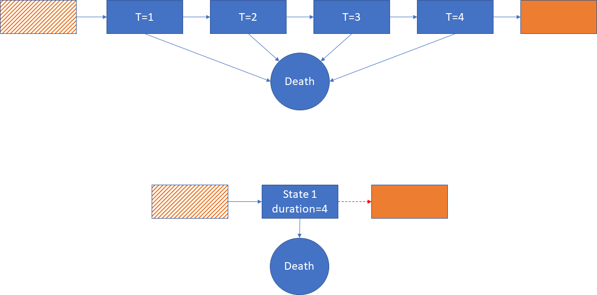

Most importantly, when transitioning out of the timed state (State 1), transitioning to 'Death' results in leaving the state, the same as transitioning to the orange flush state. Therefore, people in the final subcompartment (T=4) are also eligible for the transition, because it doesn't matter whether they leave State 1 to go to 'Death' or to go to the flush state, they have still left State 1 as required by the duration of the state. 

Duration groups
***************

As mentioned above, people in the final subcompartment are required to leave the timed compartment, but it doesn't matter whether they leave via the flush link or via a different transition. In some cases, the other transition might be to another timed compartment. In cases where the destination timed compartment is unrelated, there is no problem. For example, consider the case of someone that is vaccinated and transitioning to an infected state with an incubation period. Suppose further that the incubation state is also a timed compartment. In that case, anyone in a vaccinated subcompartment could transition into incubation, and they would enter incubation at the very start of the process, so they enter the second timed compartment as usual (via the initial subcompartment) and spend the full duration in the second state.

A special case, however, occurs if there need to be transitions that preserve the time spent in a state. In this case, the timed state does not map directly to a compartment - instead, it maps to a set of compartments. For example, suppose that we have a model where it is possible to acquire harmless symptoms mimicking the condition of interest (e.g. typhoid-like symptoms). This can be important to model if tests or treatments are being provided to people with symptoms prior to knowing whether they actually have the condition, in which case the expense of the intervention would be incurred without it having any effect on the epidemic. Suppose someone is vaccinated against typhoid with a duration of protection of 5 years. During this time, they may start off asymptomatic, but then acquire typhoid-like symptoms. They would then need to move to a 'vaccinated + typhoid-like symptoms' compartment. After some time, their symptoms might resolve, and they would move back to the 'vaccinated' state. However, the transition to and from typhoid-like symptoms should not affect the duration of protection. 

In this case, the 'vaccinated' meta-state applies to both the 'vaccinated' and 'vaccinated + typhoid-like symptoms' compartments. It is a state associated with the timed parameter, rather than the compartments. The transitions out of the two vaccinated compartments would likely be set up as follows

- A timed parameter, 'dur' representing the duration of protection
- 'vaccinated' flushing to 'susceptible', driven by the 'dur' parameter
- 'vaccinated + typhoid-like symptoms' flushing to 'susceptible + typhoid-like symptoms', also driven by the 'dur' parameter
- A transition from 'vaccinated' to 'vaccinated + typhoid-like symptoms' that preserves the time already spent in the 'vaccinated' compartment
- A transition from 'vaccinated + typhoid-like symptoms' back to 'vaccinated' that preserves the time already spent in the 'vaccinated + typhoid-like symptoms' compartment

In this way, the 'vaccinated' and 'vaccinated + typhoid-like symptoms' can be considered part of a 'duration group' because they share the same timed parameter, and transitions between them preserve the time spent in any compartment towards the duration specified by 'dur'. 

.. note::

	- A 'duration group' is the set of compartments that have flush links driven by the same timed parameter

The duration group can be implemented at the subcompartment level as shown below

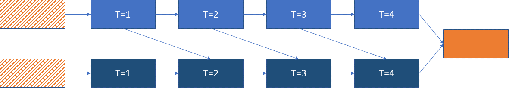

The key feature here is that because only one transition is possible in each timestep, the link from 'State 1' to 'State 2' also takes into account progression towards the total duration. 'T=1' in State 1 links to 'T=2' in State 2, and so on, resulting in the diagonal links shown in the figure above. Crucially, consider flows out of 'T=4', the final subcompartment. If an individual transitioned from State 1 'T=4' to State 2 'T=4', they would have to remain there for an additional timestep. This would result in them spending too much time in the duration group. Therefore, people in the final subcompartment are not eligible for transitions within the same duration group, as otherwise the total duration would not be preserved (keeping in mind that the use cases for timed compartments are ones where exactly preserving the duration is critically important). Therefore, in the figure above, the only transitions allowed out of the final subcompartment are to the flush state. 

These links within duration groups can coexist with links to other unrelated states as described above. For example, we could also include transitions to a death state, as shown below:

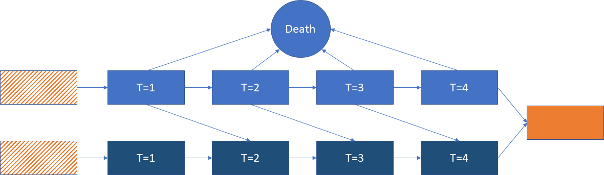

As before, Atomica simplifies this representation when defining the model, as shown below:

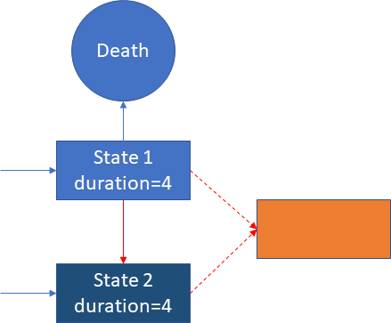

The flush links are shown as red dashed arrows. However, there is a red link between State 1 and State 2, because they belong to the same duration group and the transition between them preserves time spent in the group. This link is referred to as a 'timed link'. In contrast, a normal blue link joins 'State 1' and 'Death', because they are not part of the same duration group. 

.. note::

	- A 'timed link' connects compartments that belong to the same duration group. Transitions that go via a timed link preserve time spent in the duration group.

In practice, defining this setup in an Atomica framework file is simple. Suppose we had the following states

- Susceptible
- State 1
- State 2
- Death

and the following parameters

- 'inflow' moving people from susceptible into State 1
- 'transfer' moving people from State 1 into State 2
- 'd_rate' corresponding to the death rate 
- 'flush' corresponding to the duration spent in State 1 or State 2 (with those compartments belonging to the same duration group)

In the framework, the parameters would be defined as usual, but with 'flush' marked as a timed parameter. The transition matrix then looks like:

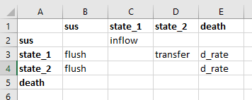

This is all that is required to define the model - the software will automatically set up 'state_1' and 'state_2' to be timed compartments, and it will automatically determine that 'state_1' and 'state_2' belong to the same duration group and set up a timed link between them. 

Architecture
************

Internally, when a compartment has a timed transition associated within it, a ``TimedCompartment`` will be created inside the model. This timed compartment internally stores a set of subcompartments (although note that the implementation simply stores the compartment's values as a matrix rather than a vector). The different components are marked on the figure below 

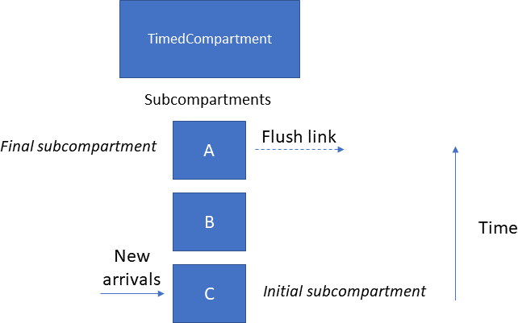

The outflow paths discussed in detail above are summarized here. There are three cases

- Transitions from a ``TimedCompartment`` to a normal ``Compartment``
- Transitions from a ``TimedCompartment`` to another ``TimedCompartment`` within the same duration group
- Transitions from a ``TimedCompartment`` to another ``TimedCompartment`` in a different duration group

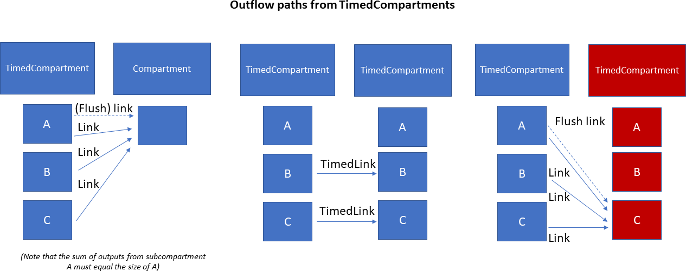

Notice how a ``TimedLink`` is only used for transitions within the same duration group.

Stepping a ``TimedCompartment`` forward in time involves three steps, shown below. 

1. First, the input from any ``TimedLinks`` is processed by directly adding the values into the corresponding subcompartments. 
2. Second, the values in the subcompartments are stepped forward. Note that the outflow from the final subcompartment (A) is computed so that the subcompartment will be emptied via the flush link (if not everyone would be removed by normal links). Therefore, the value of subcompartment (A) is zero
3. Finally, any normal inflow from outside the duration group is added into the initial subcompartment

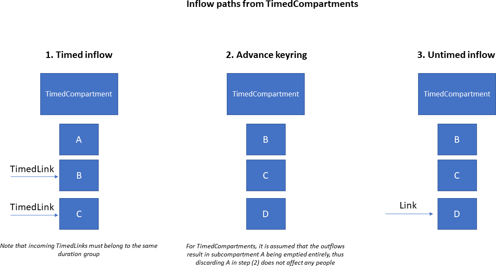

As described above, links across duration groups can transfer people in all subcompartments, while timed links can transfer anyone _except_ people in the final subcompartment. One subtle issue occurs if a number parameter is used to drive two transitions, where only one of them is a timed link. An example of this is shown below, where the ``tx`` parameter moves people into a ``dxr`` state, and this is replicated in both the unvaccinated and vaccinated groups. 

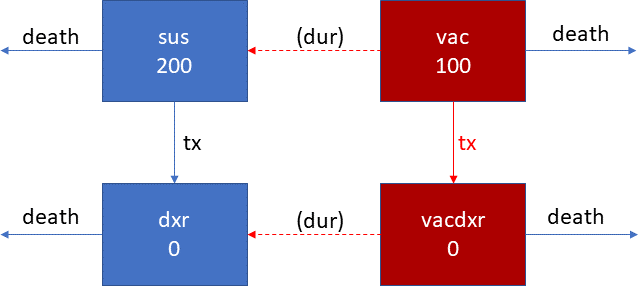

Suppose that the step size is 1, the duration of protection ``dur`` is 10, and the people in ``vac`` are uniformly distributed over arrival times. Thus, 10 people need to transition from ``vac`` to ``sus`` and they are thus ineligible to move to ``vacdxr``. The parameter ``tx`` needs to be split across the two links. Should this be done in a ``200:100`` ratio, or a ``200:90`` ratio? The model uses the ``200:100`` ratio, so the logic is the same regardless of whether a timed link or a link is driving the transition. The interpretation of this is that the eligiblity of people for the transition is not known ahead of time. In general, it is common for links to move a smaller number of people than the corresponding number parameter, simply because links often get downscaled to prevent negative compartment sizes. The other reason for using the ``200:100`` is that it better preserves the equivalency between probability and number, where the number transitioning can always be expressed as a probability relative to the number of people in the source compartments, and using that probability as the parameter value instead of a number would provide identical results. 

Although using ``200:100`` instead of ``200:90`` can seem counterintuitive, this occurs in many other places too. For example, a treatment may be provided to someone who dies of unrelated causes prior to being successfully treated. All the implementation is saying is that flows are not targeted at specific subcompartments, and if someone needs to leave the duration group and they are also eligible for a transition that would see them remain in the duration group, they are guaranteed to leave the group.

.. caution::

	If a number parameter drives a transition involving a timed link, the actual number of people moved will typically be less than the parameter's value, because people in the final subcompartment are not eligible for the transition. This is expected to be of secondary importance as long as the duration is much longer than the simulation step size, which is one of the prerequisites for using timed compartments described above. 

Transfers
*********

Transfers between populations also need to preserve time spent in a duration group - for example, children that have been vaccinated and that subsequently change age groups retain their duration of protection. However, in some cases, the duration associated with the timed compartment may differ across populations. For example, a vaccine may last longer in adults than in children, or coinfection with HIV could decrease incubation time. 

The figure below shows how discrepencies in durations are managed. The incoming ``TimedLink`` corresponds to the duration in the source population. If the duration in the destination is longer, then the original time remaining until the individual needs to leave the duration group is preserved. For example, if an 11 year old is vaccinated with a vaccine that has a duration protection of 5 years in children and 10 years in adults, and they are subsequently transferred from a ``5-14`` population to a ``15-64`` population when they turn 15, they will retain their original 5 year duration of protection, and will have their vaccine expire after spending 1 more year in ``15-64``. 

In contrast, if the destination population has a shorter duration of protection than the source population, individuals are 'accelerated' by transferring them into the initial subcompartment. For example, suppose the normal incubation period of a disease is 4 weeks, but in a PLHIV population it is 1 week. If an individual acquires the disease in the main population, and then is transferred to the PLHIV population 1 week later, they would normally have 3 weeks of incubation remaining, but this would be reduced to 1 week after the transfer. 

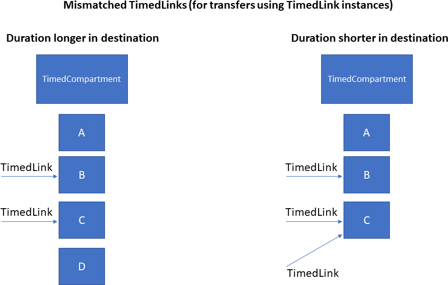

Junctions
*********

Timed compartments can be used in conjunction with junctions. However, we have seen previously that while normal links can transfer people in any subcompartment, timed links can only transfer people that are not in the final subcompartment. Thus there is not a direct substitution between the two, because eligibility within the subcompartments is different. This can be problematic when dealing with junctions. Consider the example below:

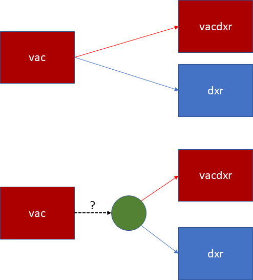

In the top case, without a junction, the two links have different eligibility in the ``vac`` compartment. However, with the junction, only a single link connects ``vac`` to the junction. What should the eligibility of this link be? In general, we cannot have outflows from a junction where some links preserve durations, and others do not.

Similarly, junctions that recieve a flush link from a duration group cannot then move those people back into the duration group. The interpretation of a flush link is that it transfers people out of the duration group. These rules must be satisfied even if the junction is indirect (transferring people via additional junctions). 

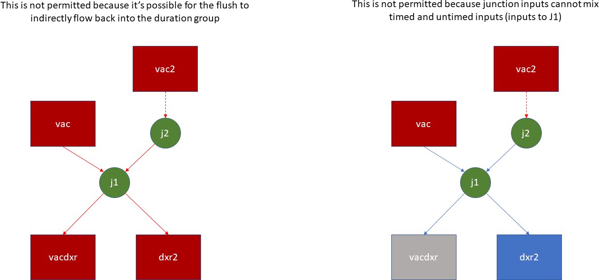

Overall, junctions follow two rules

- If a junction has a *timed* input from a compartment (i.e. not a flush link, and the input can be direct or indirect) and also has an output to the same duration group (whether direct or indirect), then the junction itself is also considered part of the duration group. In that case, *all* of its inputs must be timed inputs from the same duration group, and *all* of its outputs must be to the same duration group
- Otherwise, there must be no overlap between the duration groups flowing into the junction, and the duration groups flowing out of the junction (whether direct or indirect)

This implies that either all links are ``TimedLinks``, or no links are ``TimedLinks``, thus resolving issues of eligibility for transitions. An example of junctions belonging to a duration group is shown below.

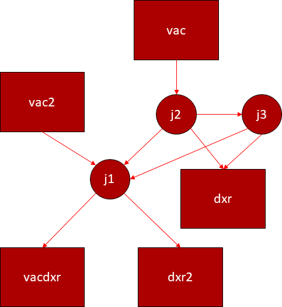

The figures below shows some examples of valid and invalid model structures. 

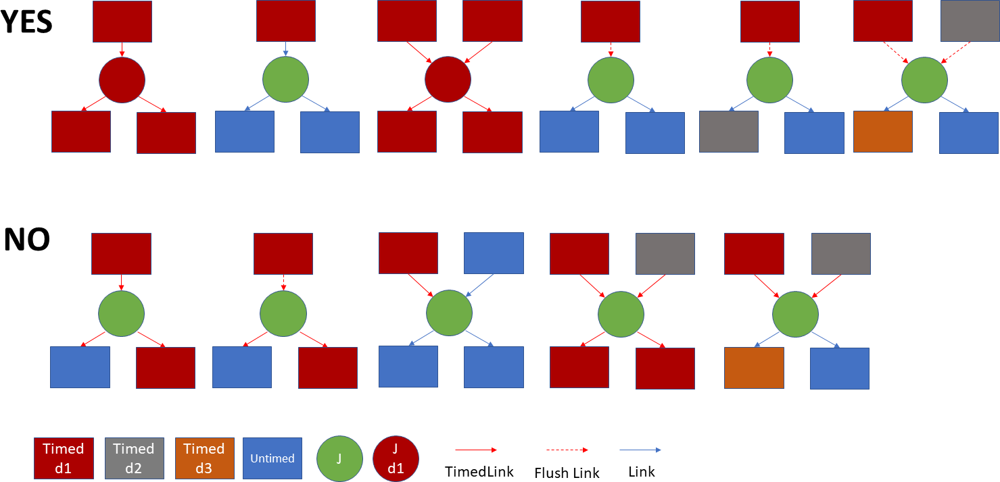

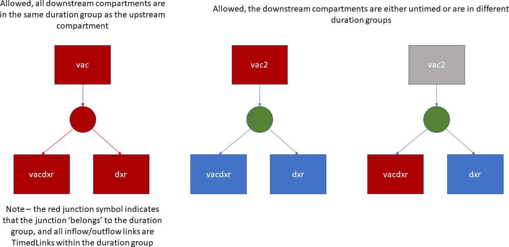

Finally, it is possible to initialize junctions with a nonzero amount of people, as an alternative to initializing compartments. This allows the junction outflow parameters to be used in the initialization. Normally, a junction within a duration group never transfers people in the final subcompartment (because they are not able to stay within the duration group). However, when initializing a timed compartment, people are added uniformly to every subcompartment including the final subcompartment. Therefore, if a junction belongs to a duration group *and* it is initialized with a nonzero number of people, the initial flush will still transfer people into the final subcompartment of any downstream compartments. The outflow paths for junctions are shown in detail below.

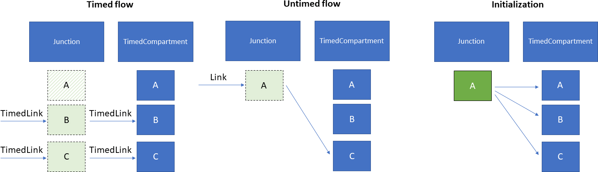